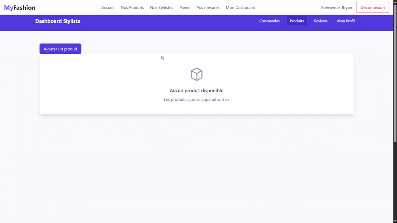
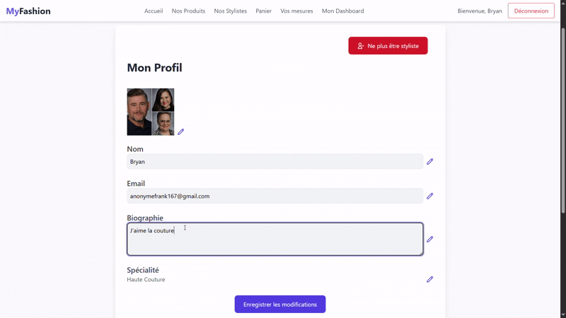
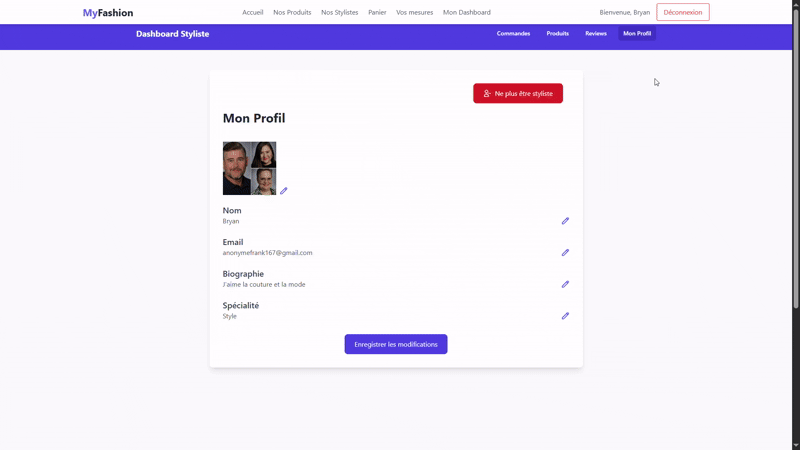

---

## 📋 **Table des Matières**
- [🎯 Aperçu du Projet](#apercu)
- [👥 Équipe](#equipe)
- [🌲 Branches Principales](#branches)
- [🏗 Structure du Projet](#structure)
- [🚀 Installation](#install)
  - [Backend](#backend)
  - [Frontend](#frontend)
  - [Mensuration](#mensuration)
- [🛠 Technologies Utilisées](#tech)
- [📸 Screenshots](#screenshots)
- [📖 Guide d'Utilisation](#guide)
- [📝 Licence](#licence)

---

<h2 id="apercu">🎯 Aperçu du Projet</h2>

**MyFashion** est une solution innovante qui propose un service de **prise de mesures corporelles automatiques à partir d'images** en utilisant la technologie **MediaPipe Pose Detection**.  
Idéal pour les secteurs de la mode, du fitness et de la santé, ce projet est structuré en trois branches :  
- ⚙️ **Backend** : API FastAPI pour le traitement des images.  
- 🎨 **Frontend** : Une interface utilisateur élégante pour interagir avec les mesures.  
- 📐 **Mensuration** : Modèles d'estimation et logique métier.

---

<h2 id="equipe">👥 Équipe</h2>

| Nom                  | Matricule | Contribution           | Participation (%) |
|----------------------|-----------|------------------------|-------------------|
| **KOUASSI DE YOBO GILBERT BRYAN (CHEF)**     | 21P082    | Management/FrontEnd/BackEnd           | 100%               |
| **MAFFO FONKOU NATACHA**       | 21P272   | Frontend/Mensuration     | 100%               |
| **MBOCK JEAN DANIEL**  | 21P269    | FrontEnd/BackEnd | 100%               |
| **ATABONG STEPHANE**     | 23P781    | FrontEnd  | 85%               |
| **BENGONO AMVELA NATHAN** | 21P091 | FrontEnd/BackEnd | 85% |
| **WOTCHOKO YOHAN** | 21P228 | FrontEnd | 90% |
| **NGOM CHRISTINE** | 21P336 | FrontEnd | 75% |
| **NGHOGUE TAPTUE FRANCK** | 21P279 | FrontEnd | 80% |
| **YIMBOU JUDE** | 21P417 |  FrontEnd | 65% |
| **NOUNDJEU NOUBISSIE FRANCK** | 21P318 | FrontEnd | 75% |


---

<h2 id="branches">🌲 Branches Principales</h2>

| Branche          | Description                            |
|-------------------|----------------------------------------|
| `main`     🟢      | Version finale du projet              |  
| `frontend`     🎨  | Développement de l'interface utilisateur |
| `backend`     ⚙️   | API et traitement des images          |
| `mensuration`  📐  | Logique d'estimation des mesures       |  

---

<h2 id="structure">🏗 Structure du Projet</h2>

```
MyFashion/
├── API/
│   ├── app/            # Modèles de calcul des mesures 
│   └── requirements.txt
│   └── run.py
├── frontend/
│   ├── src/            # Structure Angular
│   └── public/
├── backend/
│   ├── app/         # Structure Laravel
│   └── public/
│   └── database/
│   └── resources/
│   └── routes/
│   └── storage/             
└── README.md
```

---

<h2 id="install">🚀 Installation</h2>

### 🧠 **Prérequis**
- **Python** 3.8+
- **Node.js** 14+
- **PHP** 7.4+
- **Git** pour cloner le projet  

### ⚙️ **Backend setup**
```bash
cd backend
composer install
php artisan migrate
php artisan db:seed    #Lancer le seeder pour remplir la BD
```

### 🎨 **Frontend Setup**

```bash
cd frontend
npm install
```

### 📐 **Mensuration**

```bash
cd backend
python -m venv venv
source venv/bin/activate  # Sur Windows, utilisez 'venv\Scripts\activate'
pip install -r requirements.txt
```

---

<h2 id="tech">🛠 Technologies Utilisées</h2>

| Composant   | Technologie         |
|-------------|---------------------|
| **Backend** | PHP  |
| **Frontend**| TypeScript  |
| **Mensuration** | Python |

---

<h2 id="screenshots">📸 Guide d'utilisation</h2>

## **INSCRIPTION**


## **CONNEXION**


## **MOT DE PASSE OUBLIE**


## **REINITIALISATION MOT DE PASSE**


## **ACCUEIL**


##  **PRODUITS**


### **COLLECTION**


## **STYLISTES**


## **DETAIL STYLISTE**


## **PANIER**


## **FORMULAIRE MESURES**


## **MODELE DE CALCUL DE MESURES**


## **TEST**


## **DEVENIR STYLISTE**


## **MON DASHBOARD**



## **MES COMMANDES**


## **UPDATE DASHBOARD**



## **NEW STYLIST !!**


## **DETAIL NEW STYLIST**


## **REVIEW**


## **FROM PANIER AU PAIEMENT**


## **PAIEMENT AVEC VOS IDENTIFIANTS**


## **PAIEMENT REUSSI**


## **DEMANDE DE CONFIRMATION SUR VOTRE APPAREIL**


## **CALENDRIER DE RESERVATION**


## **DEMANDE DE RESERVATION**


## **CONFIRMATION DE RESERVATION**


## **DESINCRIPTION DU ROLE DE STYLISTE**




---

<h2 id="guide">📖 Guide de lancement</h2>

1. Démarrez l'API :  
   ```bash
   cd API
   python run.py  # Port 8001
   ```  

2. Lancez le frontend :  
   ```bash
   cd frontend
   ng serve       # Port 4200
   ```
3. Lancez le backend :
   ```bash
   cd backend
   php artisan serve # Port 8000
   ```

4. Ouvrez votre navigateur à [http://localhost:4200](http://localhost:4200).

5. Profitez de **MyFashion** pour estimer vos mensurations !

---

<h2 id="licence">📝 Licence</h2>
Ce projet est sous licence <b>ENSPY</b>. Consultez le fichier LICENSE pour plus d'informations.

---

**✨ Développé avec ❤️ par l'équipe MyFashion © 2025 ✨** 